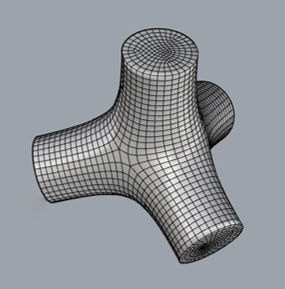
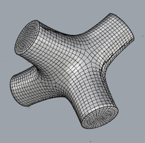

# MalAut — Automatic Multi-Part Mould Generator

MalAut is a procedural toolset for automatically generating multi-part moulds from 3D geometry. It was developed as the final outcome of the **Digital Design Techniques III** course, and explores the boundaries of computational mould design. The project demonstrates how occlusion logic, isocurve-based segmentation, and voxel workflows can be combined to split complex shapes into manufacturable parts.

All code was written in **Rhino 8** using **Grasshopper**, and relies on the following plugins:
**Nautilus**, **Stripper**, **Mesh+**, **Galapagos**, **Kangaroo2**, **TT Toolbox**, **Lunchbox**, **Axolotl**, and **Dendro**.

---

## Repository Overview

This repository is organized into four main folders:

### `Early Prototypes`
Contains early code experiments, including:
- Isoline-based and voxel-based splitting techniques
- Initial occlusion logic
- First tests with loop structures and evolutionary solvers

### `Tetrapod Early Iterations`
Documents the step-by-step development of splitting strategies applied to a tetrapod geometry. These versions explore various approaches to defining mould seams, parting directions, and lock mechanisms.

### `Tetrapod Final Moulds`
Includes final mould designs for three example shapes:
- **Simple Tetrapod**
- **Asymmetrical Tetrapod**
- **Complex Tetrapod**

Images of these variants are provided below:

  
  
  

### `Prototypes`
Photographs of the physical prototypes created using the final mould designs. These showcase the transition from digital tool to tangible outcome.

---

## License

All files in this repository are distributed under the **Creative Commons Attribution (CC-BY)** license.  
You are free to use, modify, and share the contents, provided appropriate credit is given.

---

## Authors

This project was created by:  
**Ward Bogaerts**  
**Ruben Verscheure**  
**Basira Havoli**  
**Simon Land**
